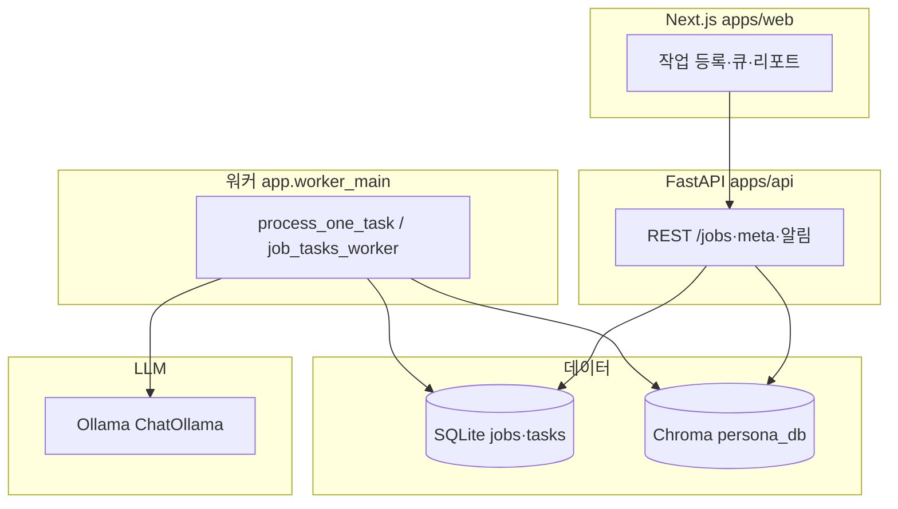

# 프로젝트 개요 (nemotron-mini)

NVIDIA **Nemotron-Personas-Korea**에서 추출한 만 19~59세 페르소나를 **Chroma 벡터 DB**로 검색하고, **로컬 Ollama(LLM)** 또는 **mock**으로 광고 **카피·이미지 A/B**를 페르소나 관점에서 점수화·집계하는 내부 도구입니다.

## 목적 (한 줄)

캠페인 맥락과 유사한 합성 페르소나를 고른 뒤, 변형 A/B에 대해 지표(관심·클릭 의도·구매 의도·신뢰 등)를 시뮬레이션합니다.

## 아키텍처 개요

- **등록**: `POST /jobs` → `jobs` 행 생성 → (기본) `preparing`에서 페르소나 검색 후 `job_tasks`(페르소나별 LLM 태스크) 적재
- **실행**: 워커가 `llm_score` 태스크를 처리하며 `ChatOllama`(또는 mock) 호출 → `partial.jsonl` 누적 → 완료 시 리포트·`job_results` 요약 저장
- **이미지 A/B**: 페이로드에 이미지 참조(URL/경로)가 있으면 멀티모달 메시지로 평가([`app/langchain_eval.py`](../app/langchain_eval.py)). 자산은 `outputs/` 및 `outputs/staging/` 정책을 따름.

자세한 API·실행 방법은 저장소 루트 [**README.md**](../README.md)를 참고하세요.

## 디렉터리 맵 (요약)

| 경로 | 설명 |
|------|------|
| `apps/web/` | Next.js UI (`app/` 라우팅·컴포넌트) |
| `apps/api/` | FastAPI 앱 및 의존성 목록 (`requirements.txt`) |
| `app/` | 공유 비즈니스 로직: DB, 워커, Chroma 검색 래퍼, LangChain 평가 등 |
| `script/` | CLI: 데이터 다운로드, 벡터 DB 빌드, 마케팅 검증 원스크립트 등 |
| `docs/` | 본 디렉터리 — 벡터 DB·프로젝트 설명 |
| `persona_db/` | Chroma 영속 디렉터리(통상 git 제외). 빌드 스크립트로 생성 |
| `outputs/` | 작업별 산출물(보고서·자산 등, 통상 git 제외) |
| `target_personas_20_59.jsonl` | 다운로드 스크립트 산출(용량 큼, 통상 git 제외) |

## 데이터 파이프라인

1. **`script/download_data.py`**: HF `nvidia/Nemotron-Personas-Korea` → 나이 필터 → `target_personas_20_59.jsonl`
2. **`script/build_vectordb.py`**: 위 jsonl → Chroma + 메타·임베딩 텍스트 (상세는 [vectordb-metadata.md](./vectordb-metadata.md))
3. **런타임**: 작업별 `payload`의 `persona_filter`와 캠페인 텍스트로 벡터 검색 → 표본 생성

## 검색·평가 코드 진입점

| 역할 | 모듈 |
|------|------|
| 페르소나 검색(기본) | `app/services/validator_runner.py` → `_retrieve_filtered_personas` |
| 페르소나 검색(LangChain) | `env PERSONA_RETRIEVE_BACKEND=langchain_chroma` → `app/chroma_langchain.py` |
| LLM 평가(큐 워커) | `app/job_tasks_worker.py` → `app/langchain_eval.py` |
| 프롬프트·점수 해석 공통 | `script/marketing_validator.py` (직통 Ollama 텍스트 API는 이미지 캠페인 미지원) |

## 제한·유의사항

- 결과는 **실제 사용자 반응·트래픽 A/B가 아니라** 합성 페르소나 + LLM 응답에 기반합니다.
- Nemotron 카드 및 데이터셋에 명시된 **독립성 가정·공공 통계 한계**는 그대로 이 파이프라인에 간접 반영됩니다.
- 페르소나 수 상한 등은 API·폼에서 가드되어 있습니다([`README.md`](../README.md) 참고).

## 문서 목록

| 문서 | 내용 |
|------|------|
| [vectordb-metadata.md](./vectordb-metadata.md) | Chroma 메타 필드·임베딩 문구·재빌드 |
| [README.md](../README.md) | 설치, 실행, 환경 변수, Docker, CLI |
