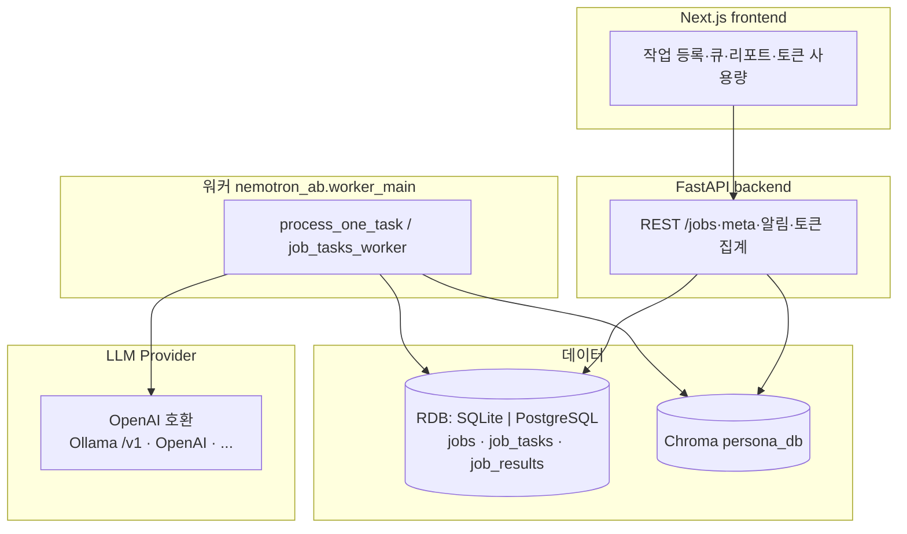

# 프로젝트 개요 (Nemotron-AB)

NVIDIA **Nemotron-Personas-Korea**에서 추출한 만 19~59세 페르소나를 **Chroma 벡터 DB**로 검색하고, **OpenAI 호환 LLM**(Ollama `/v1`, OpenAI, 그 외 호환 엔드포인트) 또는 **mock**으로 **단문(텍스트)·이미지 A/B 변형**을 페르소나 관점에서 점수화·집계하는 오픈소스 도구입니다. 마케팅 카피뿐 아니라 UI 카피, 알림·공지 문구, 이미지 등 짧은 콘텐츠 A/B 가 모두 적용 대상입니다.

## 목적 (한 줄)

A/B 작업의 맥락(`context`)과 유사한 합성 페르소나를 고른 뒤, 변형 A/B 에 대해 지표(관심·클릭 의도·구매 의도·신뢰 등)를 시뮬레이션합니다.

## 아키텍처 개요

- **등록**: `POST /jobs` → `jobs` 행 생성 → (기본) `preparing`에서 페르소나 검색 후 `job_tasks`(페르소나별 LLM 태스크) 적재
- **실행**: 워커가 `llm_score` 태스크를 처리하며 LangChain `ChatOpenAI` (또는 mock) 호출 → `partial.jsonl` 누적 → 완료 시 리포트·`job_results` 요약 저장. 응답의 `usage_metadata` 에서 토큰 사용량을 추출해 `job_tasks.{prompt,completion,total}_tokens` 에 저장하고 job 단위 집계.
- **이미지 A/B**: 페이로드에 이미지 참조(URL/경로)가 있으면 멀티모달 메시지로 평가([`nemotron_ab/langchain_eval.py`](../nemotron_ab/langchain_eval.py)). 자산은 `outputs/` 및 `outputs/staging/` 정책을 따름.
- **DB 백엔드**: 기본 SQLite. `DATABASE_URL=postgresql+psycopg://…` 로 PostgreSQL 도 동일 코드 경로로 사용 가능 (Phase 3.2 의 dialect-agnostic SQL + `DBConnection` wrapper 덕분). 자세한 내용은 [`database.md`](./database.md).
- **LLM Provider**: `llm_base_url` + `llm_model` 만으로 어떤 OpenAI 호환 엔드포인트도 동일 코드 경로로 호출. 토큰 사용량/JSON 강제/프롬프트 프로파일(`full`/`compact`) 안내는 [`llm-providers.md`](./llm-providers.md).

자세한 API·실행 방법은 저장소 루트 [**README.md**](../README.md)를 참고하세요.

## 디렉터리 맵 (요약)

| 경로 | 설명 |
|------|------|
| `frontend/` | Next.js UI (`app/` 라우팅·컴포넌트) |
| `backend/` | FastAPI (`main.py` 진입점, `app.py` 팩토리, `routers/`·`schemas/`·`services/`, `requirements.txt`) |
| `nemotron_ab/` | 공유 비즈니스 로직: DB, 워커, Chroma 검색 래퍼, LangChain 평가 등 |
| `scripts/` | CLI: 데이터 다운로드, 벡터 DB 빌드, A/B 평가 원스크립트(`ab_validator.py`) 등 |
| `examples/` | 샘플 A/B 입력·페르소나·프롬프트 스키마 |
| `docs/` | 본 디렉터리 — 프로젝트/DB/LLM/벡터DB 설명 |
| `tests/` | 단위/통합 테스트 (`pytest`). 단위 61, 통합 3 + `needs_postgres` smoke. 자세한 안내는 [`tests/README.md`](../tests/README.md) |
| `data/` | 대용량 데이터·런타임 산출물 안내(통상 git 제외) |
| `persona_db/` | Chroma 영속 디렉터리(통상 git 제외). 빌드 스크립트로 생성 |
| `outputs/` | 작업별 산출물(보고서·자산 등, 통상 git 제외) |
| `target_personas_20_59.jsonl` | 다운로드 스크립트 산출(용량 큼, 통상 git 제외) |

## 데이터 파이프라인

1. **`scripts/download_data.py`**: HF `nvidia/Nemotron-Personas-Korea` → 나이 필터 → `target_personas_20_59.jsonl`
2. **`scripts/build_vectordb.py`**: 위 jsonl → Chroma + 메타·임베딩 텍스트 (상세는 [vectordb-metadata.md](./vectordb-metadata.md))
3. **런타임**: 작업별 `payload`의 `persona_filter`와 `context`·`text_a`·`text_b` 로 벡터 검색 → 표본 생성

## 검색·평가 코드 진입점

| 역할 | 모듈 |
|------|------|
| 페르소나 검색(기본) | `nemotron_ab/services/validator_runner.py` → `_retrieve_filtered_personas` |
| 페르소나 검색(LangChain) | `env PERSONA_RETRIEVE_BACKEND=langchain_chroma` → `nemotron_ab/chroma_langchain.py` |
| LLM 평가(큐 워커) | `nemotron_ab/job_tasks_worker.py` → `nemotron_ab/langchain_eval.py` |
| LLM 프로바이더 추상화 | `nemotron_ab/llm_provider.py` (`LLMConfig`, `make_chat_llm`, `extract_usage`) |
| 프롬프트 프로파일/입력 가드 | `nemotron_ab/prompt_profile.py` (`resolve_prompt_profile`, `truncate_persona_view`) |
| DB 접속/wrapper | `nemotron_ab/db_engine.py` (`resolve_database_url`, `make_engine`, `DBConnection`) |
| DB 스키마/CRUD | `nemotron_ab/db.py` (dialect-agnostic SQL) |
| 프롬프트·점수 해석 공통 | `scripts/ab_validator.py` (직통 텍스트 API 는 이미지 입력 미지원) |

## 제한·유의사항

- 결과는 **실제 사용자 반응·트래픽 A/B가 아니라** 합성 페르소나 + LLM 응답에 기반합니다.
- Nemotron 카드 및 데이터셋에 명시된 **독립성 가정·공공 통계 한계**는 그대로 이 파이프라인에 간접 반영됩니다.
- 페르소나 수 상한 등은 API·폼에서 가드되어 있습니다([`README.md`](../README.md) 참고).

## 문서 목록

| 문서 | 내용 |
|------|------|
| [vectordb-metadata.md](./vectordb-metadata.md) | Chroma 메타 필드·임베딩 문구·재빌드 |
| [database.md](./database.md) | DATABASE_URL / SQLite ↔ PostgreSQL / SA wrapper / 마이그레이션 |
| [llm-providers.md](./llm-providers.md) | OpenAI 호환 LLM 엔드포인트·토큰 사용량·프롬프트 프로파일 |
| [README.md](../README.md) | 설치, 실행, 환경 변수, Docker, CLI |
| [tests/README.md](../tests/README.md) | 단위/통합 테스트 구조 + pytest 마커 + Postgres smoke |
| [CHANGELOG.md](../CHANGELOG.md) | 릴리즈/변경 이력 |
